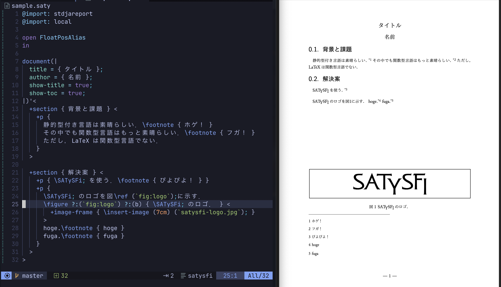

# satysfi-footnote-scheme-ext

A package to allow SATySFi to have a floating boxes at the bottom of pages.

[SATySFi](https://github.com/gfngfn/SATySFi) で図をページ下部に配置できるようにした．



## Demo

```bash
git clone https://github.com/sano-jin/satysfi-footnote-scheme-ext.git
cd satysfi-footnote-scheme-ext

# satysfi-base を利用しているので，base のインストールが必要．
opam install satysfi-base
satyrographos install

cd demo
satysfi sample.saty # sample.pdf が生成される．
```

この出力結果は [demo/sample.pdf](demo/sample.pdf) となる．

## What is satysfi-footnote-scheme-ext?

このパッケージは
[footnote-scheme.satyh](https://github.com/gfngfn/SATySFi/blob/master/lib-satysfi/dist/packages/footnote-scheme.satyh)
の拡張版であり，
footnote を活用して図をページ下部に配置することを可能にする．
footnote-scheme.satyh の後方互換性がある（ことを意図して作った[^1]）ので，
単に footnote-scheme.satyh の代わりにこのパッケージを用いるようにすれば良い．

`FootnoteScheme` モジュールが公開している field は

- `val initialize : unit -> unit`
- `val start-page : unit -> unit`
- `val main : context -> (int -> inline-boxes) -> (int -> block-boxes) -> inline-boxes`
- `val main-no-number : context -> (unit -> inline-boxes) -> (unit -> block-boxes) -> inline-boxes`
- (new) `val add-float-bottom : block-boxes -> inline-boxes`

であり，`add-float-bottom` が追加で新たに公開している field である
（他の関数も内部的にはかなり色々追加の処理をしている）．

## 使い方

1. footnote-scheme-ext.satyh を install する．
   現在まだ satyrographos に登録していないので，
   [src/footnote-scheme-ext.satyh](src/footnote-scheme-ext.satyh) を手動でコピーしてきて手元に置いてやる必要がある．
   また，satysfi-base を利用しているので，これもインストールしてやる必要がある．
2. footnote-scheme.satyh の代わりに，
   このパッケージ footnote-scheme-ext.satyh を import/require する．
3. ページ下部に配置したい `float-box: block-text` がある場合は，
   `FootnoteScheme.add-float-bottom float-box` としてやる．
4. `FootnoteScheme.initialize`, `FootnoteScheme.start-page` などは，
   従来の footnote-scheme.satyh と同じように呼び出してやる必要がある．

[^1]: バグっていて違う挙動になる可能性はある．．．

## 使用例

[SATySFi/lib-satysfi/dist/packages/stdjareport.satyh](https://github.com/gfngfn/SATySFi/tree/master/lib-satysfi/dist/packages/stdjareport.satyh)
の `\figure` コマンドを改造して，top/bottom の指定ができるようにしたいとする．

1. satysfi-base をインストール．
   ```bash
   opam install satysfi-base
   satyrographos install
   ```
2. このパッケージ `footnote-scheme-ext` をインストール．
   とりあえずは
   [src/footnote-scheme-ext.satyh](src/footnote-scheme-ext.satyh) を手動でコピーしてきて手元に置いてやる必要がある．
3. `stdjareport.sath` で `@require: footnote-scheme` の代わりに `@import: footnote-scheme-ext` する．
   ```
   @import: footnote-scheme-ext
   ```
4. まず `stdjareport.satyh` において，float box の position の型を定義しておく．
   ```
   type floatpos =
     | FloatPosTop
     | FloatPosBottom
   ```
5. `\figure` コマンドが `floatpos` を引数に取れるように型を変更する．
   ```
   direct \figure : [string?; floatpos?; inline-text; block-text] inline-cmd
   ```
6. `\figure` コマンド内部において，`floatpos` で `FloatPosBottom` を指定されたときは
   `FootnoteScheme.add-float-bottom` するようにする．
   ```
   % パラメータ floatpos を新たに追加．
   let-inline ctx \figure ?:labelopt ?:floatpos caption inner =
     ...
     let bb-inner = ... in
       match floatpos with
       | Some(FloatPosBottom) ->
           % FloatPosBottom を指定されたときは footnote-scheme-ext の関数を用いてページ下部に配置する．
           FootnoteScheme.add-float-bottom bb-inner
       | _ ->
         hook-page-break (fun pbinfo _ -> (
           let () = display-message (`register `# ^ (arabic pbinfo#page-number)) in
           ref-float-boxes <- (pbinfo#page-number, bb-inner) :: !ref-float-boxes
         ))
   ```
7. ユーザに `FloatPosBottom` などのように書かせるのが手間なら，Alias 用のコマンドを作っておく．
   例えば以下のようにすることで，
   ユーザは `open FloatPosAlias in` をすれば，
   `` \figure ?:(`label`) ?:(b) {This is a caption} <...> ``
   のようにして使うことができる．
   ```
   module FloatPosAlias : sig
     val t : floatpos
     val b : floatpos
   end = struct
     let t = FloatPosTop
     let b = FloatPosBottom
   end
   ```

これらの改造を施した stdjareport.satyh が，
[demo/stdjareport.satyh](demo/stdjareport.satyh) である．

[demo/local.satyh](demo/local.satyh) 及び
[demo/satysfi-logo.jpg](demo/satysfi-logo.jpg) は，
[SATySFi の公式デモのもの](https://github.com/gfngfn/SATySFi/blob/master/demo/local.satyh)
をそのままコピーしてきて使っている．

## その他

開発者向け（自分用）のメモは [memo.md](memo.md) にある．

## TODO

satyrographos に登録する．
ドキュメントを作る．
